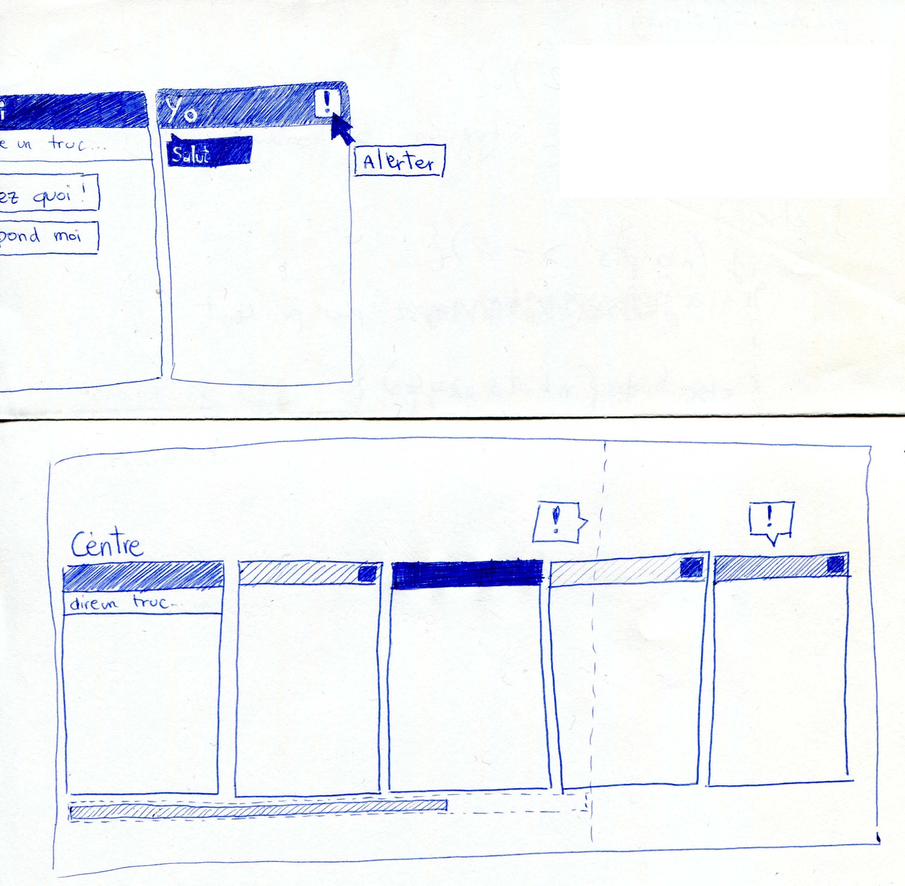

### Compétences mises en oeuvre

#### A1.3.4 Déploiement d'un service

Le service est actuellement déployé sur mon serveur personnel et
accessible à l'adresse [http://polygonev2.club1.fr](http://polygonev2.club1.fr)

#### A3.2.1 Installation et configuration d'éléments d'infrastructure

Installation de [PM2](http://pm2.keymetrics.io/), un gestionnaire
d'application NodeJs, permettant, entre autre, de redémarrer automatiquement les applications en cas de bug.

#### A4.1.2 Conception ou adaptation de l'interface utilisateur d'une solution applicative

Conception de l'interface utilisateur à l'aide de croquis

#### A4.1.3 Conception ou adaptation d'une base de données

La première version du projet utilisait une base de données MySql pour l'ensemble
des messages envoyés.

Pour la version 2, seuls les messages mémorisés sont enregistrés dans une base
de données.

#### A4.1.7 Développement, utilisation ou adaptation de composants logiciels

Utilisation de packages JavaScripts grâce à NPM, en particulier SocketIO et Express.

Utilisation également de [bibliothèques](https://github.com/n-peugnet/PolygoneV2/tree/develop/public/include)
trouvées sur internet comme [rsa.js et ses dépendances](http://www-cs-students.stanford.edu/~tjw/jsbn/)
afin de pouvoir générer des clés RSA

#### A5.1.1 Mise en place d'une gestion de configuration

Utilisation de git et [GitHub](https://github.com/n-peugnet/PolygoneV2/) pour
la gestion de version.

#### A5.2.4 Étude d'une technologie, d'un composant, d'un outil ou d'une méthode

-   Limites de PHP + AJAX pour le temps réel.
-   Etude des clés RSA et de leur génération.